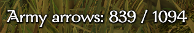

# Army Arrow Counter

## Overview

This is the repo for a [Mount & Blade II: Bannerlord](https://store.steampowered.com/app/261550/Mount__Blade_II_Bannerlord/) mod named Army Arrow Counter. It's a simple utility mod which counts the amount of ammunition your army has remaining, updating a small UI counter element in the bottom left of the screen (example below). 

The mod is hosted and downloadable on Nexus Mods [here](https://www.nexusmods.com/mountandblade2bannerlord/mods/448), with over 20,000 downloads! 

It's also available [here](https://steamcommunity.com/sharedfiles/filedetails/?id=2875690459) on Steam Workshop.

More about the mod and its gameplay effects/options can be read on Nexus/Steam linked above - this repo focuses more on the development side.

## Repository Structure

- When packaged, ArmyArrowCounter (AAC) has the following structure:
  - `bin`
    - `Win64_Shipping_Client`
      - Contains all the DLL(s) for the mod.
      - Is not located in this repo - these are generated when the project is built.
  - `config`
    - Contains custom AAC config.
    - This corresponds exactly to the `/src/config` folder in this repository.
  - `GUI`
    - Contains Bannerlord xml files configuring the presence/positions/formatting, etc of the UI counter.
    - This corresponds exactly to the `/src/GUI` folder in this repository.
  - `SubModule.xml`
    - Contains AAC mod/module metadata for Bannerlord to process.
    - This corresponds exactly to the `/src/SubModule.xml` file in this repository.
- `/src/` (unsurprisingly) contains the source code, along with the above-mentioned folders/files.

## Contributions

### Issues / Bug Reports

These are more than welcome! I monitor both the Nexus "Bugs" and "Posts" tabs, but I am also happy to receive reports here on Github.

### Bug Fixes / Feature Implementations / Pull Requests

Happy to receive these as well! I apologize in advance for when you dive into the code - I am not a C# developer, so it's very likely that I am breaking a bunch of rules/conventions of C# and misusing features - I'd be ecstatic for these cases to be pointed out and corrected!
About pull-requests, I may ask questions around the in-game testing that has been done, and I may request code style/design changes if deemed necessary. For features which I have not endorsed, it's likely a good idea to contact me first before implementing them, to avoid any denials/reworks!
